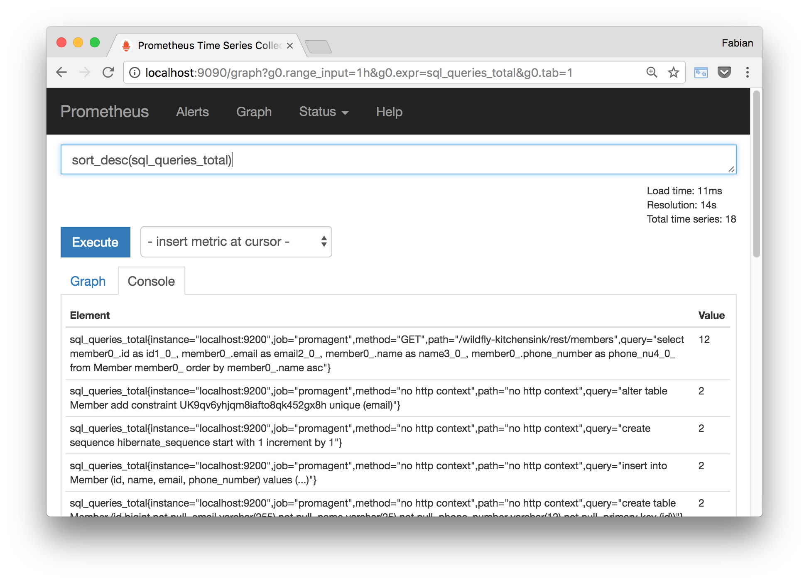

Promagent
=========

_Instrumenting Java Web applications without Modifying their Source Code._

Promagent is a Java agent providing [Prometheus](https://prometheus.io/) metrics for Java Web applications without modifying the application's source code.
Promagent uses the [Byte Buddy](http://bytebuddy.net/) bytecode manipulation library to insert Prometheus metrics during application startup.

The current Promagent version covers two metrics:

* HTTP: Number and duration of web requests.
* SQL: Number and duration of database queries.

The agent was tested with [Spring Boot](https://projects.spring.io/spring-boot/) and with the [Wildfly application server](http://wildfly.org/).

Example
-------



Some example Prometheus queries evaluating Promagent metrics:

* Top five most frequent SQL queries: `topk(5, sql_queries_total)`.
* Top five longest-running HTTP requests (median): `topk(5, http_request_duration{quantile="0.5"})`.
* If a database query is triggered within the context of an HTTP request, the HTTP `path` is added as a label to the `sql_*` metrics. That way, we can relate database queries to the corresponding HTTP requests:
  * Time ratio spent on the database when processing an HTTP request: `sum(sql_query_duration{quantile="0.5"}) by (query,method,path) / on(method,path) group_left sum(http_request_duration{quantile="0.5"}) by (method,path)`.
  * Which database queries are triggered how often for which HTTP request: `sum(sql_queries_total) by (method, path, query) / on(method, path) group_left sum(http_requests_total) by (method, path)`.

Customizing the Labels
----------------------

The Prometheus server internally stores one time series for each label value. Therefore, Promagent strips HTTP URLs and SQL queries to make sure that there are not too many different label values:

* For HTTP requests, path parameters are replaced with placeholders. Promagent aims to use REST resources like `/item/{id}` as labels, not in actual paths like `/item/123`.
* For SQL queries, values are stripped. Promagent aims to use the structure of the query like `INSERT INTO ITEMS (ID, NAME, PRICE) VALUES (...)` as a label, not in its values like `INSERT INTO ITEMS (ID, NAME, PRICE) VALUES (23, 'abc', 17.5)`.

Of course, replacing path parameters and SQL values is application specific. Promagent implements a very simple replacement in `ServletHook.stripPathParameters()` and `JdbcHook.stripValues()`, but you probably need to customize these methods for your application.

Spring Boot Demo
----------------

Download and compile the [Promagent](https://github.com/fstab/promagent).

```bash
git clone https://github.com/fstab/promagent.git
cd promagent
mvn clean package
cd ..
```

Download and compile a [Spring Boot Getting Started](https://spring.io/guides/gs/accessing-data-rest/) application.

```bash
git clone https://github.com/spring-guides/gs-accessing-data-rest.git
cd gs-accessing-data-rest/complete
mvn clean package
cd ../..
```

Run the Spring Boot application with the Promagent attached.

```bash
java \
    -javaagent:promagent/promagent-dist/target/promagent.jar=port=9300 \
    -jar gs-accessing-data-rest/complete/target/gs-accessing-data-rest-0.1.0.jar
```

Go to [http://localhost:8080](http://localhost:8080) to view the Spring Boot application,
go to [http://localhost:9300/metrics](http://localhost:9300/metrics) to view the Prometheus metrics.

Wildfly Demo
------------

Download and compile the [Promagent](https://github.com/fstab/promagent).

```bash
git clone https://github.com/fstab/promagent.git
cd promagent
mvn clean package
cd ..
```

Download and compile a [Wildfly Quickstart](https://github.com/wildfly/quickstart) application.

```bash
git clone https://github.com/wildfly/quickstart.git
cd quickstart/kitchensink
mvn clean package
cd ../..
```

Download and extract the [Wildfly application server](http://wildfly.org/).

```bash
curl -O http://download.jboss.org/wildfly/10.1.0.Final/wildfly-10.1.0.Final.tar.gz
tar xfz wildfly-10.1.0.Final.tar.gz
```

Run the Wildfly application server with the Promagent attached.

```bash
cd wildfly-10.1.0.Final
LOGMANAGER_JAR=$(find $(pwd) -name 'jboss-logmanager-*.jar')
export JAVA_OPTS="
    -Xbootclasspath/p:${LOGMANAGER_JAR}
    -Djboss.modules.system.pkgs=org.jboss.logmanager,io.promagent.agent
    -Djava.util.logging.manager=org.jboss.logmanager.LogManager
    -javaagent:../promagent/promagent-dist/target/promagent.jar=port=9300
"
./bin/standalone.sh
```

In a new Shell window, deploy the quickstart application.

```bash
cd wildfly-10.1.0.Final
./bin/jboss-cli.sh --connect --command="deploy ../quickstart/kitchensink/target/kitchensink.war"
```

Go to [http://localhost:8080/kitchensink](http://localhost:8080/kitchensink) to view the quickstart application,
go to [http://localhost:9300/metrics](http://localhost:9300/metrics) to view the Prometheus metrics.

Exposing Metrics
----------------

Promagent supports three different ways of exporting metrics for the Prometheus server:

* Pomagent has a built-in HTTP server. This is used in the examples above. The server is started when the
  command line argument `port` is used, as for example `-javaagent:agent.jar=host=localhost,port=9300`.
  The `host` argument is optional, it defaults to the wildcard IP address.
  If `port` is omitted the built-in server is not started.
* The [promagent-exporter](https://github.com/fstab/promagent/tree/master/promagent-exporter) module implements
  a simple Web application in WAR file format. If you deploy the _promagent-exporter/target/promagent.war_ on your
  server, it will collect Promagent metrics via JMX and expose them under it's deployment URL,
  like [http://localhost:8080/promagent](http://localhost:8080/promagent).
* All metrics are made available via JMX, so any JMX client can be used to access the metrics.

Status
------

This is a demo project. The main goal is to learn the internals of bytecode manipulation and class loading in Java application servers. I am planning to work on the following:

* Try it with more application servers ([Payara](http://www.payara.fish/), [TomEE](http://tomee.apache.org/)) and adjust the code if necessary.
* Add automated test, preferably integration tests that run an application server in a Docker container and check if the metrics are collected as expected.
* Write documentation about the internal implementation, mainly the bytecode manipulation and class loading aspects.

I am currently not planning to add a large number of out-of-the-box metrics. If you want to extend Promagent with your own metrics, do the following:

* Clone this project on [GitHub](https://github.com/fstab/promagent/).
* Copy the `ServletHook` or `JdbcHook` as a template for your own hook class.
* Add your hook class to the list of hooks in the `HookFactory`.
* In your hook class, adapt the `@Hook`, `@Before` and `@After` annotations as well as the `init()`, `before()` and `after()` methods.
* Of course, I am always happy to see people using this code. So if you like, please open a GitHub Issue and say "Hello" (GitHub Issues are not only for reporting problems, they are useful for any communication).

For examples of methods you might want to instrument, look at related projects, like [inspectIT](http://www.inspectit.rocks/) (hooks are configured [here](https://github.com/inspectIT/inspectIT/tree/master/inspectit.server/src/main/external-resources/ci/profiles/common)) or [stagemonitor](http://www.stagemonitor.org/).

Thank You ConSol
----------------

This project is supported as part of the R&D activities at [ConSol Software GmbH](https://www.consol.de/). See the [ConSol Labs Blog](https://labs.consol.de/) for more info.
